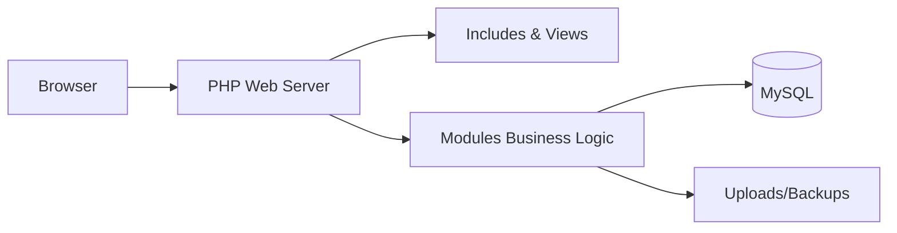
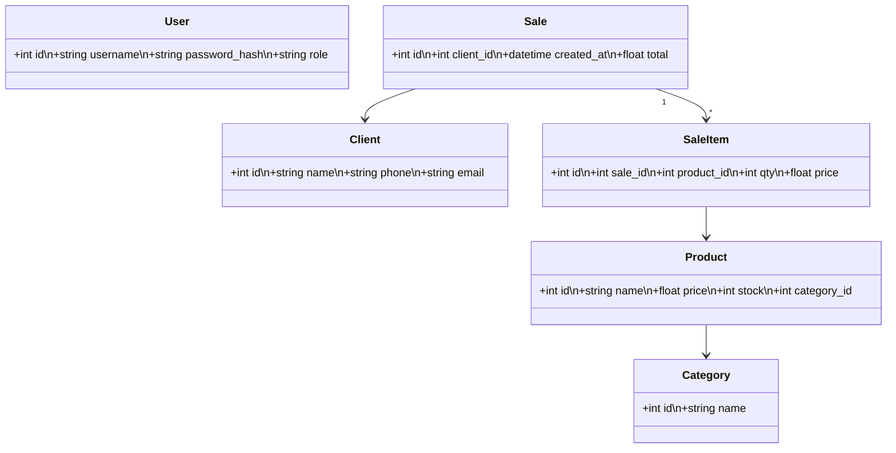
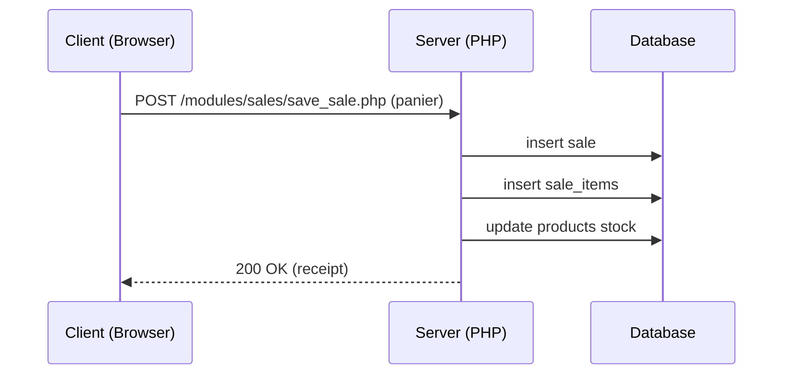
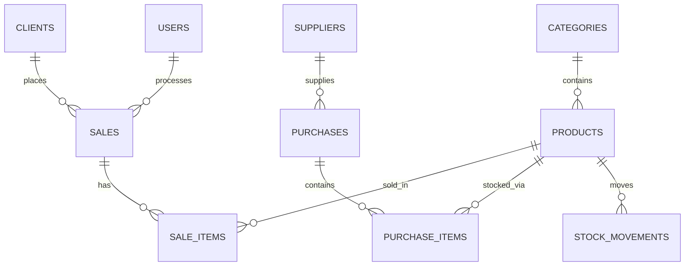

# CHAPITRE III : CONCEPTION DE LA PLATEFORME

Ce document présente la conception de la plateforme (analyse du projet existant, architecture, modélisation UML, conception de la base de données et description des modules). Le projet est une application PHP (structure modulaire) utilisant une base de données relationnelle (MySQL/MariaDB via `config/db.php`).

## 1. Architecture générale du système

- **Présentation (client)** : Navigateur web (HTML/CSS/JS dans `assets/`) accède aux pages PHP (`index.php`, `public_home.php`, modules/*).
- **Couche présentation** : Fichiers PHP dans `includes/` (`header.php`, `footer.php`, `sidebar.php`) et vues des modules.
- **Couche logique métier** : Modules dans `modules/` (produits, stock, sales, purchases, clients, suppliers, users, etc.). Fonctions utilitaires dans `includes/functions.php`.
- **Couche données** : `config/db.php` gère la connexion à MySQL. Les données sont stockées dans des tables relationnelles (schéma ci‑dessous).
- **Composants additionnels** : `uploads/` pour fichiers (images, backups), `backups/` pour sauvegardes, `assets/js/script.js` côté client pour interactions.

Mermaid - Diagramme de composants (simplifié) :



## 2. Modélisation UML

- Cas d'utilisation (exemples) :
  - Gérer produits (CRUD)
  - Gérer stocks (entrée/sortie)
  - Vendre (POS / panier en ligne)
  - Gérer paiements
  - Gérer livraisons
  - Administration (utilisateurs, paramètres, rapports)

Diagramme de classes (abstrait) :



Exemple de séquence (vente rapide) :



### Acteurs du système

Les acteurs principaux impliqués dans l'application :

- **Administrateur** : gestion des utilisateurs, rôles, paramètres, sauvegardes, rapports et audits.
- **Pharmacien / Caissier** : gestion quotidienne des ventes (POS), gestion des stocks, saisie des achats et ventes.
- **Client / Acheteur** : navigation du catalogue, création de panier, paiement et suivi des commandes (lors de la vente en ligne).
- 
- **Livreur / Transporteur** : prise en charge et suivi des livraisons, mise à jour des statuts d'expédition.
- **Comptable / Auditeur** : consultation des rapports financiers, rapprochements et historiques d'audit.
- **Système de paiement (externe)** : prestataire externe pour le traitement des paiements par carte/mobile.
 - **Comptable / Auditeur (important)** : consultation des rapports financiers, rapprochements et historiques d'audit.
 - **Système de paiement (externe) — important** : prestataire externe pour le traitement des paiements par carte/mobile.

Diagramme de cas d'utilisation (simplifié) :

```mermaid
usecaseDiagram
  actor Administrateur as Admin
  actor Pharmacien as Pharm
  actor Client as Client
  actor Fournisseur as Supplier
  actor Livreur as Delivery
  actor Comptable as Accountant
  actor Paiement as PaymentGateway

  Admin --> (Gérer utilisateurs)
  Admin --> (Gérer paramètres)
  Pharm --> (Gérer produits)
  Pharm --> (Gérer stocks)
  Pharm --> (Enregistrer vente)
  Client --> (Passer commande)
  Client --> (Payer commande)
  Supplier --> (Fournir produits)
  Delivery --> (Mettre à jour livraison)
  Accountant --> (Consulter rapports)
  Paiement --> (Valider paiement)

  (Payer commande) .> Paiement : <<include>>
```

## 3. Conception de la base de données

Proposition de schéma principal (tables clés). Les colonnes ci‑dessous sont indicatives ; adaptez les types et contraintes.

- `categories` : `id` PK, `name`, `description`, `created_at`
- `products` : `id` PK, `name`, `sku`, `category_id` FK, `price`, `cost_price`, `quantity` (stock), `unit`, `image_path`, `created_at`, `updated_at`
- `clients` : `id`, `name`, `phone`, `email`, `address`, `created_at`
- `suppliers` : `id`, `name`, `phone`, `email`, `address`, `created_at`
- `purchases` : `id`, `supplier_id`, `reference`, `total`, `created_at`, `status`
- `purchase_items` : `id`, `purchase_id`, `product_id`, `qty`, `price`
- `sales` : `id`, `client_id` (nullable), `user_id`, `reference`, `total`, `paid`, `status`, `created_at`
- `sale_items` : `id`, `sale_id`, `product_id`, `qty`, `price`
- `stock_movements` : `id`, `product_id`, `qty`, `type` (IN/OUT/ADJ), `reference_type`, `reference_id`, `user_id`, `created_at`
- `payments` : `id`, `related_type` (sale/purchase), `related_id`, `amount`, `method`, `transaction_ref`, `created_at`
- `deliveries` : `id`, `sale_id`, `status`, `carrier`, `tracking_number`, `address`, `shipped_at`, `delivered_at`
- `users` : `id`, `username`, `password_hash`, `full_name`, `role`, `created_at`
- `roles` (optionnel) : `id`, `name`, `permissions` (json)
- `settings` : `key`, `value`
- `audit_logs` : `id`, `user_id`, `action`, `object_type`, `object_id`, `details`, `created_at`

ER diagramme (simplifié) :



## 4. Description des modules

- **Gestion des produits**
  - Fonctionnalités : création, modification, suppression, import/export, gestion images.
  - Fichiers clés : `modules/products/*` (add.php, edit.php, index.php, view.php).
  - Tables : `products`, `categories`, `stock_movements` (sur modification de stock).

- **Gestion des stocks**
  - Fonctionnalités : entrées (achats), sorties (ventes), ajustements, alertes de stock minimum, historique.
  - Fichiers clés : `modules/stock/*` (in.php, out.php, index.php).
  - Tables : `stock_movements`, `products`, `purchase_items`, `sale_items`.

- **Vente en ligne**
  - Fonctionnalités attendues : catalogue public, panier, création de commande, génération de facture/receipt.
  - Fichiers existants pour vente locale : `modules/sales/` (pos.php, invoice.php, save_sale.php, view.php).
  - Intégration : si vous exposez une interface publique, réutiliser `modules/sales/save_sale.php` pour enregistrer ventes en ligne.
  - Tables : `sales`, `sale_items`, `clients`, `payments`, `deliveries`.

- **Paiement**
  - Fonctionnalités : enregistrement paiement, méthodes (espèces, carte, mobile money), rapprochement, remboursements.
  - Fichiers : rechercher `save_sale.php`, `save_purchase.php` pour points d'enregistrement des paiements.
  - Tables : `payments`, `sales`, `purchases`.

- **Livraison**
  - Fonctionnalités : création d'envoi, suivi statut, création d'étiquettes, mise à jour du status (expédié, livré), adresse de livraison.
  - Tables : `deliveries`, lien vers `sales`.

- **Administration**
  - Fonctionnalités : gestion des utilisateurs, rôles, paramètres, sauvegardes, rapports, audit.
  - Fichiers : `modules/users/*`, `modules/settings/*`, `modules/audit/*`, `backups/`.
  - Tables : `users`, `roles`, `settings`, `audit_logs`.

## Remarques d'implémentation et recommandations

- Valider et préparer les requêtes SQL pour prévenir les injections (utiliser PDO avec requêtes préparées).
- Stocker les mots de passe avec `password_hash()` et vérifier avec `password_verify()`.
- Mettre en place des contrôles d'accès basés sur rôle avant d'autoriser les actions sensibles.
- Ajouter contraintes d'intégrité (FK) et index sur colonnes utilisées pour recherches/joins (`product_id`, `sale_id`, `created_at`).
- Sauvegardes régulières : script automatique vers `backups/` et export SQL.
- Journalisation des mouvements de stock et des opérations financières dans `audit_logs`.

## Annexes

- Emplacements utiles dans le projet :
  - [includes/functions.php](includes/functions.php) : fonctions utilitaires
  - [config/db.php](config/db.php) : connexion base de données
  - [modules/products/index.php](modules/products/index.php) : gestion produits
  - [modules/stock/index.php](modules/stock/index.php) : gestion stock
  - [modules/sales/pos.php](modules/sales/pos.php) : point de vente

---
Document généré automatiquement d'après l'analyse de la structure du projet.
